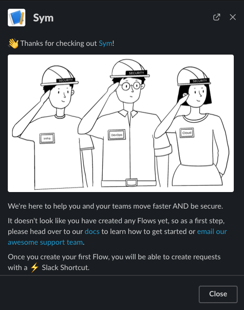
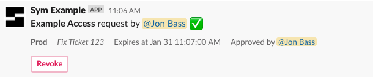
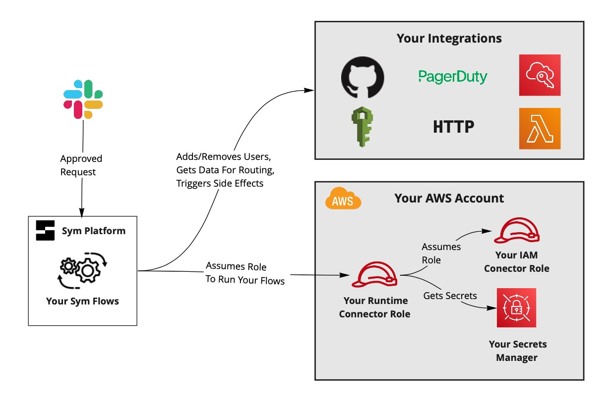
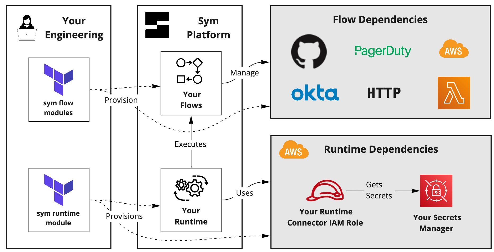

# Sym Okta Quickstart

A starter template to get an Okta access workflow set up for your team.

## End-User Experience

End-users interact with Sym workflows from Slack. Slack connects to the Sym platform, which executes Flows that use the Sym Integrations we wire together in this repo.


### Making Requests


### Approved Requests


## Getting Started

The [app environment](app) includes everything you need to get an Okta workflow up and running. Just configure a few variables in [`terraform.tfvars`](app/terraform.tfvars) and you're on your way!

### Set up the `symflow` CLI

You'll need to work with the Sym team to get your organization set up with access to the Sym platform. Once you're onboarded, you can:

1. Install the [`symflow`](https://docs.symops.com/docs/install-sym-flow-cli) CLI.
2. Configure your `sym_org_slug` in [`terraform.tfvars`](app/terraform.tfvars).

### Install the Sym Slack App into your workspace

Once you've got `symflow` installed, you need to install Sym's slack app into your workspace.

1. Grab the Slack Workspace ID you're installing Sym into. The easiest place to find this is in the URL you see when you run Slack in your web browser.
2. Configure your `slack_workspace_id` in [`terraform.tfvars`](app/terraform.tfvars).
3. Create the Slack app using `symflow`. This will generate an install link that you can either use directly or forward on to your Slack Workspace Administrator:

```
$ symflow services create --service-type slack --external-id SLACK-EXTERNAL-ID
```

Once Slack is set up, try launching the Sym app. You should see a welcome modal like this one, since we haven't set up any flows yet:



### Set Up Your Slack Channels

The workflow is set up to route access requests to the `#sym-requests` channel. You can change this channel in [`terraform.tfvars`](app/terraform.tfvars).

Sym will also send any errors that happen during a workflow run (due to integration or other config issues) to a configurable errors channel. You can configure this in `terraform.tfvars` as well.

1. Configure `flow_vars.request_channel` if you don't want the default value of `#sym-requests`.
2. Configure `error_channel` if you don't want the default value of `#sym-errors`.

### Test Your Provisioning Setup

Once you've got Slack set up, its time to provision your flow! Your Okta integration won't be ready quite yet, but we can just make sure all the pipes are connected.

If you plan to provision your flows from a CI pipeline, [we've got you covered](https://docs.symops.com/docs/using-bot-tokens).

```
$ symflow login --email my-user@myco.com
$ export AWS_PROFILE=my-profile
$ cd app && terraform apply
```

Once you've provisioned your flow, try to make an access request! You should be able to make the request, but you'll get an error when you try to approve access because we haven't configured Okta yet. Check in your `errors_channel` and you should see something like:


### Set Up Your Okta API Token

Sym stores your Okta API Token in an AWS Secrets Manager value. By default, the `sym-runtime` module sets up a shared AWS Secrets Manager secret that you add key/value pairs to for the secrets that your runtime needs to access. Now that you've provisioned infrastructure, its time to get this configured.

1. Use our [setup instructions](https://docs.symops.com/docs/okta) to create an Okta API token that has access to manage your target groups.
2. Configure the API key in the AWS Secrets Manager secret configured by your [`sym-runtime`](modules/sym-runtime/main.tf) module:

```
$ OKTA_API_TOKEN=<get-from-okta>
$ aws secretsmanager put-secret-value \
  --secret-id /symops.com/shared \
  --secret-string "{\"okta_api_token\": \"$OKTA_API_TOKEN\"}"
```

Note that you are free to define your secrets in separate AWS Secret Manager resources if you choose, you'll just need to update where the Okta Access Flow grabs its secret from.

### Set Up Your Okta Targets and Test E2E!

Identify the initial Okta groups that Sym will move users in and out of. You can always change and modify these groups later, so we recommend starting with an existing group or creating a temporary group for testing.

1. Get the IDs of the Okta groups that you'll be starting with. Configure these in `okta_targets` in [`terraform.tfvars`](app/terraform.tfvars).
2. Configure your [Okta domain](https://developer.okta.com/docs/guides/find-your-domain/main/) in the `okta_org_domain` variable in [`terraform.tfvars`](app/terraform.tfvars).

Now that you've configured Okta targets, its time to reapply your Terraform configs and validate that your integration works end-to-end. Run a `terraform apply` and then request access to your Okta target. Once complete, your request should be approved with no errors:



### Next Steps

Once you've got the E2E Okta workflow implemented, here are some next steps to consider:

* Set up [reporting](https://docs.symops.com/docs/reporting-overview). Ship audit data to a flexible group of log destinations.
* Update your workflow to require that users be members of a certain Okta group to approve access:
  1. Configure `flow_vars.approver_group` with the Okta group ID in [`terraform.tfvars`](app/terraform.tfvars).
  2. Uncomment the `hook` annotation on the `on_approve` method in [`impl.py`](modules/okta-access-flow/impl.py).
     This is just one example of what you can do with [hooks in the SDK!](https://docs.symops.com/docs/handlers)
* Manage [end-users](https://docs.symops.com/docs/manage-users). Sym handles the "happy path" where user emails match across systems automatically. You can use the `symflow` CLI to configure user mappings when required.
* Iterate on your flow logic. Maybe change things to allow self-approval only for on-call users?
* Set up another access flow!

## Backend Data Flow

When an End-User approves an escalation request, the Sym Platform does the following:

1. Assumes your [Runtime Connector](https://docs.symops.com/docs/runtime-connector) IAM role. This role lives in your AWS account, and has access to tagged secrets within your AWS Secrets Manager instance.
2. Grabs the Okta API Token that [you've configured for Sym](https://docs.symops.com/docs/okta) from AWS Secrets Manager.
3. Adds or removes the user from the appropriate group in Okta.



### Security Considerations

Sym's Runtime Connector IAM Role has a trust relationship with Sym's production AWS account. This trust relationship allows the Sym platform to securely assume your Runtime Connector IAM role without a password. This is called a "role chaining" type of trust relationship.

The RuntimeConnector module ensures that we use an [external id](https://docs.aws.amazon.com/IAM/latest/UserGuide/id_roles_create_for-user_externalid.html) when assuming your IAM Role per AWS best practices.

## Modules

Your engineers provision resources in both AWS and Sym. The modules are factored to keep the AWS and Sym resources managed independently.



### sym-runtime module

The [`sym-runtime`](modules/sym-runtime) creates a shared Runtime that executes all your Flows.

### okta-access-flow

The [`okta-access-flow`](modules/okta-access-flow) module defines the workflow that your engineers will use to get temporary Okta access.

## About Sym

This workflow is just one example of how [Sym Implementers](https://docs.symops.com/docs/deploy-sym-platform) use the [Sym SDK](https://docs.symops.com/docs) to create [Sym Flows](https://docs.symops.com/docs/flows) that use the [Sym Approval](https://docs.symops.com/docs/sym-approval) Template.
