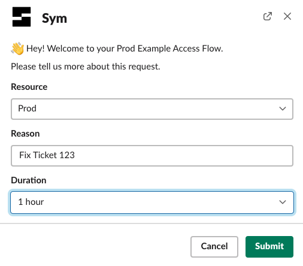
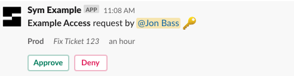
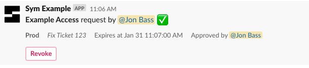

ID: sym_okta_quickstart
Summary: Sym helps engineering teams automate security workflows with a sophisticated access management platform.
Feedback Link: mailto:sales@symops.io
Analytics Account: UA-156651818-3

# Sym Okta Quickstart Tutorial

## Welcome
Duration: 1:00

Sym helps engineering teams automate security workflows with a sophisticated access management platform that lets you bring audited & automatic just-in-time access to AWS resources, SQL databases, internal apps & dashboards, and a variety external SaaS products. Workflows are provisioned via infra-as-code, often right beside the definitions of the resources they protect, and are easily customizable with our Python SDK.

If you want to check out a demo, go [here](https://demo.symops.com/)!

### Workflow

Today I want to walk you through setting up a simple access control workflow using Slack, Okta and Sym. By the end of this tutorial, you'll have the ability to wrap any resource in Okta with a fully-configurable request-and-approval flow, using a declaratively provisioned Slack bot.

The complete code for this tutorial can be found at [`@symopsio/sym-okta-quickstart`](https://github.com/symopsio/sym-okta-quickstart).

## What will it look like?
Duration: 1:00

Users will interact with this Sym `Flow` via Slack. Slack connects to the Sym platform, which executes a `Flow` that use the `Integrations` we are wiring together in this tutorial.


#### Making Requests

This is what a request will look like.



Sym will send a request for approval to the appropriate users or channel based on your [`impl.py`](https://github.com/symopsio/sym-okta-quickstart/blob/main/modules/okta-access-flow/impl.py).




Finally, upon approval, Sym gives you access to the Okta group and updates Slack.




## Environment Setup
Duration: 3:00

To complete this tutorial, you should [install Terraform](https://learn.hashicorp.com/terraform/getting-started/install), and make sure you have a working install of Python 3.

### What's Next

The [app environment](https://github.com/symopsio/sym-okta-quickstart/tree/main/app) includes everything you need to get an Okta workflow up and running. Just configure a few variables in [`terraform.tfvars`](https://github.com/symopsio/sym-okta-quickstart/tree/main/app/terraform.tfvars) and you're on your way!

Here's all that you'll need to do:

- Set up the `symflow` CLI
- Install the Sym Slack app
- Configure your Slack channels
- Test your deploy flow
- Set up your Okta API token
- Set up your Okta `Targets`
- E2E test and more goodies!

## Set up the `symflow` CLI
Duration: 3:00

You'll need to work with the Sym team to get your organization set up with access to the Sym platform. Once you're onboarded, continue from here.

### Install the `symflow` CLI

The [`symflow`](https://docs.symops.com/docs/install-sym-flow-cli) CLI is what you use to interact with Sym's control plane.

```bash
$ brew install symopsio/tap/symflow
```

```
==> Tapping symopsio/tap
Cloning into '/opt/homebrew/Library/Taps/symopsio/homebrew-tap'...
remote: Enumerating objects: 1148, done.
remote: Counting objects: 100% (285/285), done.
remote: Compressing objects: 100% (222/222), done.
remote: Total 1148 (delta 134), reused 156 (delta 59), pack-reused 863
Receiving objects: 100% (1148/1148), 324.27 KiB | 6.36 MiB/s, done.
Resolving deltas: 100% (530/530), done.
Tapped 14 formulae (43 files, 582.7KB).
==> Downloading https://github.com/symopsio/sym-flow-cli-releases/releases/download/v1.3.7/sym-flow-cli-darwin-x64.tar.gz
######################################################################## 100.0%
==> Installing symflow from symopsio/tap
🍺  /opt/homebrew/Cellar/symflow/1.3.7: 10,351 files, 198MB, built in 33 second
```

### Login

We'll have to login before we can do anything else. Sym also supports SSO, if your organization has set it up.

```bash
$ symflow login
```

```
Sym Org: healthy-health
Username: yasyf@healthy-health.co
Password: ************
MFA Token: ******

Success! Welcome, Yasyf. 🤓
```

### Set your Org slug

You simply have to take the `slug` given to you by the Sym team, and set it in [`app/terraform.tfvars`](https://github.com/symopsio/sym-okta-quickstart/tree/main/app/terraform.tfvars).

```hcl
# app/terraform.tfvars

sym_org_slug = "healthy-health"
```

## Install the Sym Slack app
Duration: 3:00

Now that you've got `symflow` installed, you need to install Sym's Slack app into your workspace.

### Grab your Workspace ID

The easiest place to find this is in the URL you see when you run Slack in your web browser. It will start with a `T`, and look something like `TABC123`.

This also goes in [`app/terraform.tfvars`](https://github.com/symopsio/sym-okta-quickstart/tree/main/app/terraform.tfvars).

```hcl
# app/terraform.tfvars

slack_workspace_id = "TABC123"
```

### Provision your Slack app

`symflow` has a convenient way to provision an instance of Sym's Slack app. This command will generate an install link that you can either use directly, or forward on to your Workspace Administrator.

```bash
$ symflow services create --service-type slack --external-id T123ABC
```

```
Successfully set up service type slack with external ID TABC123!
Generated an installation link for the Sym Slack app:

https://static.symops.com/slack/install?token=xxx

Please send this URL to an administrator who has permission to install the app. Or, if that's you, we can open it now.

Would you like to open the Slack installation URL in a browser window? [Y/n]:
```

Once Slack is set up, try launching the Sym app with `/sym` in Slack.

You should see a welcome modal like this one, since we haven't set up a `Flow` yet:


## Configure your Slack channels
Duration: 1:00

This `Flow` is set up to route access requests to the `#sym-requests` channel. You can change this channel in—wait for it—[`terraform.tfvars`](https://github.com/symopsio/sym-okta-quickstart/tree/main/app/terraform.tfvars).

Sym will also send any errors that happen during a `Run` (due to external failures or config issues) to a configurable error channel. You'll never guess where you can configure this.

```hcl
# app/terraform.tfvars

flow_vars = {
  request_channel = "#sym-requests"
}
```

You can also change the channel that errors are routed to, which defaults to `#sym-errors`.


```hcl
# app/terraform.tfvars

error_channel = "#sym-errors"
```

## Test your deploy flow
Duration: 1:00

Now that Slack is set up, let's provision your flow! The Okta `Integration` isn't ready quite yet, but we can at least make sure all the pipes are connected.

```bash
$ export AWS_PROFILE=my-profile
$ cd app
$ terraform apply
```

```
...
Plan: 18 to add, 0 to change, 0 to destroy.

Do you want to perform these actions?
  Terraform will perform the actions described above.
  Only 'yes' will be accepted to approve.

  Enter a value: yes

Apply complete! Resources: 18 added, 0 changed, 0 destroyed.
```

Positive
: By the way, if you plan to provision your flows from a CI pipeline, [we've got you covered](https://docs.symops.com/docs/using-bot-tokens).

### Try out a request!

You should be able to make a request now with `/sym req`, though you'll get an error when you try to approve access, since we haven't configured Okta yet.

Check in your `errors_channel` and you should see something like this:


## Set up your Okta API token
Duration: 3:00

Sym stores your Okta API token in an AWS Secrets Manager value. By default, the `sym-runtime` module sets up a shared AWS Secrets Manager secret that you add key/value pairs to for the secrets that your `Runtime` needs to access.

### Create your API token

Follow our [Okta setup instructions](https://docs.symops.com/docs/okta) to create an Okta API token that has access to manage your target groups.

### Set your API token in Sym

Configure the API key in the AWS Secrets Manager secret configured by your [`sym-runtime`](https://github.com/symopsio/sym-okta-quickstart/tree/main/modules/sym-runtime/main.tf) module like so.

```bash
$ OKTA_API_TOKEN=xxx
$ aws secretsmanager put-secret-value \
  --secret-id /symops.com/shared \
  --secret-string "{\"okta_api_token\": \"$OKTA_API_TOKEN\"}"
```

Positive
: n.b. You are free to define your secrets in separate AWS Secret Manager resources if you choose, you'll just need to update where your `Flow` grabs its secret from.

## Set up your Okta `Targets`
Duration: 3:00

Identify the initial Okta groups that Sym will move users in and out of. You can always change and modify these groups later, so we recommend starting with an existing group or creating a temporary group for testing.

### Set Group IDs

Get the IDs of the Okta groups that you'll be starting with. Configure these in `okta_targets` in [`terraform.tfvars`](https://github.com/symopsio/sym-okta-quickstart/tree/main/app/terraform.tfvars).

```hcl
# app/terraform.tfvars

okta_targets = [
  {
    label    = "AWS Ops Admin",
    group_id = "CHANGEME"
  }
]
```

### Set Okta domain

Set your [Okta domain](https://developer.okta.com/docs/guides/find-your-domain/main/) as well.

```hcl
# app/terraform.tfvars

okta_org_domain = "xxx.okta.com"
```

## E2E test and more goodies!
Duration: 3:00

Now that you've configured your Okta `Targets`, its time to reapply your Terraform configs and validate that your integration works end-to-end.

Run a `terraform apply` and then request access to your Okta target. Once complete, your request should be approved with no errors!

```bash
$ terraform apply
```

```
...
Plan: 0 to add, 3 to change, 0 to destroy.

Do you want to perform these actions?
  Terraform will perform the actions described above.
  Only 'yes' will be accepted to approve.

  Enter a value: yes

Apply complete! Resources: 0 added, 3 changed, 0 destroyed.
```

### What's next?

Here are some next steps to consider:

* Set up [reporting](https://docs.symops.com/docs/reporting-overview). Ship audit data to a flexible group of `LogDestinations`.
* Update your `Flow` to require that users be members of a certain Okta group to approve access:
  1. Configure `flow_vars.approver_group` with the Okta group ID in [`terraform.tfvars`](https://github.com/symopsio/sym-okta-quickstart/tree/main/app/terraform.tfvars).
  2. Uncomment the `hook` annotation on the `on_approve` method in [`impl.py`](https://github.com/symopsio/sym-okta-quickstart/tree/main/modules/okta-access-flow/impl.py).
     This is just one example of what you can do with [hooks in the SDK!](https://docs.symops.com/docs/handlers)
* Manage [users](https://docs.symops.com/docs/manage-users). Sym handles the "happy path" where user emails match across systems automatically. You can use the `symflow` CLI to configure user mappings when required.
* Iterate on your `Flow` logic. Maybe change things to allow self-approval only for on-call users?
* Set up another access `Flow`!
